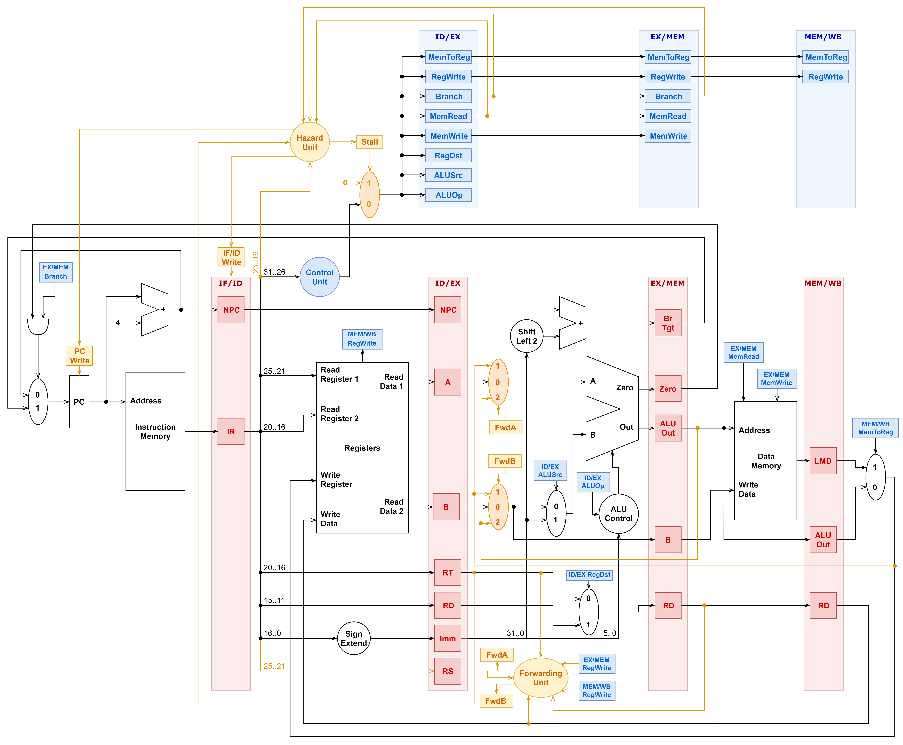

# mips-pipeline-simulator
A MIPS Simulator with a 5-stage pipeline.

The simulator will run code from a file given as CLI argument (default: **program.asm**) and print the actions and resulting memory after every clock.

Run it with `-s` to output only the final state of the registers and memory.

Supported Instructions
-------
|Instruction|Format|Result|
|-|-------------------------------------|-|
| `add $d, $s, $t`     | `000000\|rs[5]\|rt[5]\|rd[5]\|00000\|100000` | `rd = rs + rt`
| `sub $d, $s, $t`     | `000000\|rs[5]\|rt[5]\|rd[5]\|00000\|100010` | `rd = rs - rt`
| `and $d, $s, $t`     | `000000\|rs[5]\|rt[5]\|rd[5]\|00000\|100100` | `rd = rs & rt`
| `or $d, $s, $t`      | `000000\|rs[5]\|rt[5]\|rd[5]\|00000\|100101` | `rd = rs \| rt`
| `xor $d, $s, $t`     | `000000\|rs[5]\|rt[5]\|rd[5]\|00000\|100110` | `rd = rs ^ rt`
| `nor $d, $s, $t`     | `000000\|rs[5]\|rt[5]\|rd[5]\|00000\|100111` | `rd = ~(rs \| rt)`
| `mult $d, $s, $t`    | `000000\|rs[5]\|rt[5]\|rd[5]\|00000\|011000` | `rd = rs * rt`
| `div $d, $s, $t`     | `000000\|rs[5]\|rt[5]\|rd[5]\|00000\|011001` | `rd = rs // rt`
| `sll $d, $t, shamt`  | `000000\|00000\|rt[5]\|rd[5]\|shamt\|000000` | `rd = rt << shamt`
| `srl $d, $t, shamt`  | `000000\|00000\|rt[5]\|rd[5]\|shamt\|000010` | `rd = rt >> shamt`
| `lw $t, offset($s)`  | `100011\|rs[5]\|rt[5]\|----offset[16]----` | `rt = mem(rs + offset)`
| `sw $t, offset($s)`  | `101011\|rs[5]\|rt[5]\|----offset[16]----` | `mem(rs + offset) = rt`
| `beq $s, $t, offset` | `000100\|rs[5]\|rt[5]\|----offset[16]----` | `if rs == rt: advance_pc(offset << 2)`
| `addi $t, $s, imm`   | `001000\|rs[5]\|rt[5]\|------imm[16]-----` | `rt = rs + imm`

Datapath
-------

